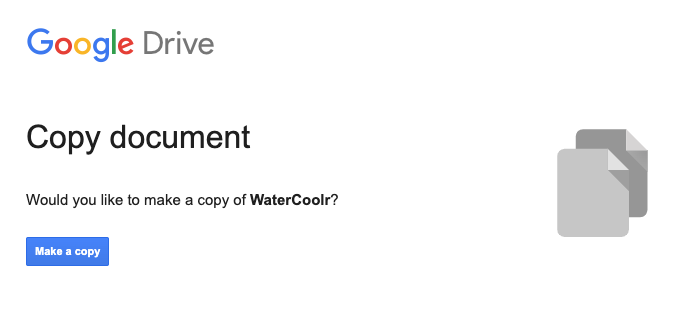
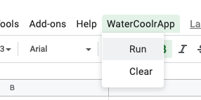
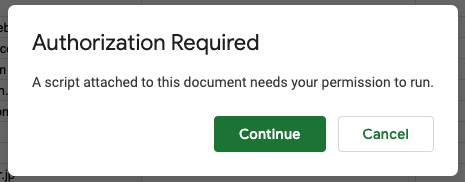
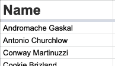

# WaterCoolr
A Google Sheet app to generate random groups for water cooler conversations over video.

## How to use

[Copy the Google Sheets document to your Drive](https://docs.google.com/spreadsheets/d/1-D36ZWbM8Mp0l4JDLSi7AWmCY8ooQkjtIXDTMT2m0As/copy) (login required)

Shortly after opening the spreadsheet, you'll see a "WaterCoolrApp" option in the menu bar. 
Click it and select "Run".

The first time you run the application you will need to authorize the script. It will only ask for permission on the WaterCoolr document. Click "Continue", and "Allow" on the next page. Again, this is the only time you'll need to do this.

 

### Add your own list of participants

The Spreadsheet comes with fake names and email addresses to use as demonstration. 

In the "**Employees List**" sheet, edit the "Name" column with your own list.

> **Note:** The "Email" and "Department" lists are never used. They're only to demonstrate how you can add more data on participants. It could be useful for sending out a notice by email, or to add context to each name in the list. Feel free to add as many columns you like.

In the "**Video Chat URL**" sheet, edit the URL and change the `<my-company>` part with your company name, or feel free to add whatever path-ending you like. The app uses Jitsi Meet as default, but if you want you can change the URL to your custom needs, but the script adds a number behind the URL to specify grouping so be aware that your custom chat service must support that.

Share **your** document with your colleagues or friends.

**Run the app and let the conversation begin!** 🗣

